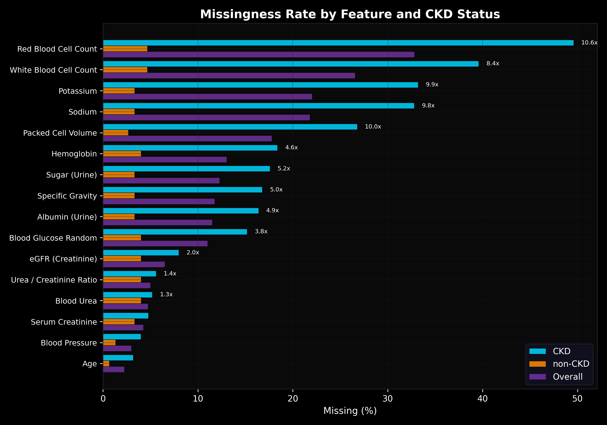
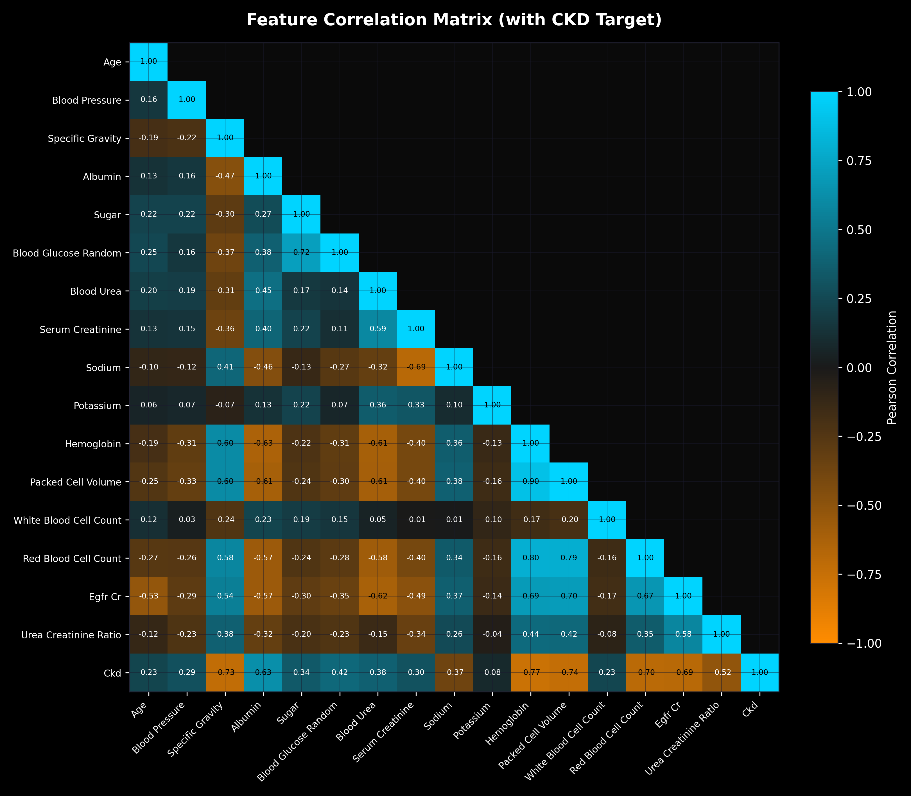
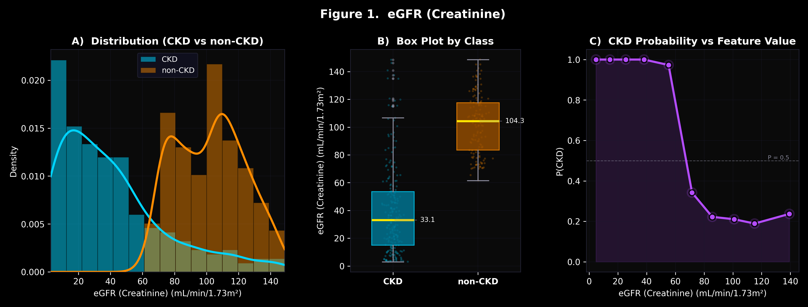
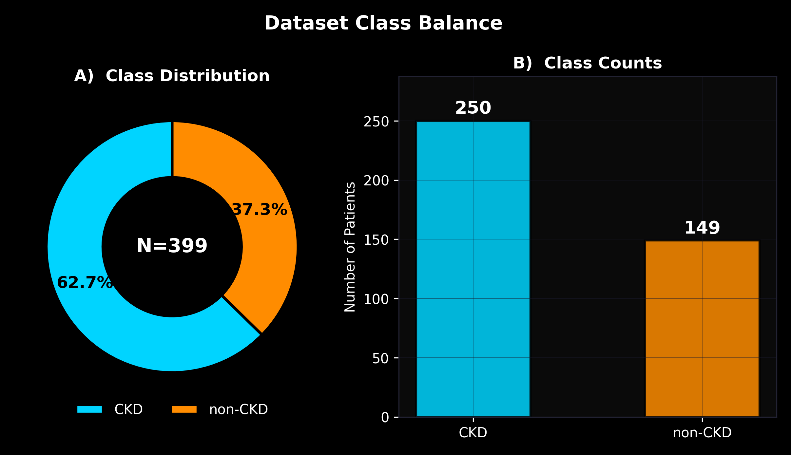

# Ren AI: project portfolio

**Early chronic kidney disease (CKD) detection from routine blood work.**
From a 399-patient teaching dataset to a 39,622-adult national survey, with a held-out,
pre-registered evaluation, an external test that failed, a diagnosis, and a disclosed fix.

GitHub: [devv3-bit/Ren-AI-V1](https://github.com/devv3-bit/Ren-AI-V1), branch `nhanes-v2`.
Full analytical report: [reports/nhanes/RESULTS.md](reports/nhanes/RESULTS.md).
Every run, including the ones that did worse: [reports/nhanes/run_log.md](reports/nhanes/run_log.md).

## At a glance

| | |
|---|---|
| Cohort | 39,622 US adults, CDC NHANES 2005-Mar 2020 (7 cycles, 56 files) |
| Label | KDIGO single visit: eGFR < 60 OR urine ACR >= 30 mg/g (prevalence 17.1%) |
| Features | 17 routine blood tests + age, sex, BP, BMI, diabetes + 2 derived kidney scores |
| Held-out AUC, 2017-Mar 2020 (n = 8,038) | **0.856** [0.844, 0.868], gradient boosting |
| Early-stage AUC (eGFR >= 60, albuminuria-only CKD) | **0.751** [0.733, 0.768] |
| External, 399 hospital patients | **0.64** first look, **0.95** after a pre-specified fix (second look, disclosed) |
| Engineering | 10 modules, 12 scripts, 42 tests, seeds fixed, test cycle touched once |

## 1. The journey

### v1, Dec 2025 to Apr 2026: learn the problem on 399 patients

The UCI Chronic Kidney Disease dataset (400 rows, 399 usable; 250 CKD, 149 not) is the
classic classroom CKD set: 24 attributes from an Indian hospital, labels that are clinical
diagnoses of mostly advanced disease.

What was built:

- a schema contract (`src/config.py`, `src/data/contracts.py`) so raw column names map to one
  canonical vocabulary and every stage fails fast when a column is missing;
- a biological plausibility layer with hard and soft bounds for every lab
  (`src/data/validate_labs.py`);
- the CKD-EPI 2021 race-free eGFR equation as a first-class derived feature
  (`src/features/derive.py`);
- missing-value indicators, after the EDA showed missingness is not random: CKD patients were
  3 to 5 times more likely to have a lab missing (`texts/missingness_report.txt`);
- log transforms for heavy-tailed labs, median imputation, standardisation and an L2 logistic
  regression with balanced class weights.

Result: 5-fold cross-validated ROC-AUC 0.999 (confusion matrix [[148, 1], [3, 247]]), with
coefficients that read like nephrology: specific gravity, hemoglobin and eGFR protective;
albumin and glucose as risk; the "sodium was never measured" indicator carrying an odds ratio
of 3.25. Nineteen EDA figures, nine whitepaper figures and a draft whitepaper came out of it.

The catch: 0.999 on 399 nearly separable rows says almost nothing about how the model would
behave on real people. That question became v2.

### v2, Oct 2026: a real population and honest numbers

- Downloaded seven public CDC NHANES cycles (56 SAS transport files, 76,496 participants) and
  harmonised them into the v1 schema: 2005-06 creatinine recalibrated with the CDC formula,
  white cells rescaled, blood pressure averaged across readings, ACR computed where the CDC did
  not release it, codes recoded.
- Defined the cohort in four auditable steps (age >= 18, not pregnant, creatinine and ACR
  measured) and the label by KDIGO thresholds, single visit.
- Wrote the rules before modelling: temporal split (train 2005-2016, test 2017-Mar 2020), all
  tuning by 5-fold CV on train, a selection rule fixed in advance, thresholds chosen on train
  out-of-fold predictions, the test cycle evaluated once.
- Compared an interpretable logistic model (the v1 structure) with gradient boosting and two
  baselines. Gradient boosting won by the pre-registered rule.
- Held-out AUC 0.856; early-stage AUC 0.751; eGFR alone 0.743; age + sex + diabetes + BP 0.763.
- External test on the original 399 hospital patients with a 14-feature logistic variant: 0.64.

### v3, Oct 2026: diagnose, pre-specify, re-test, disclose

- Diagnosis (nothing retrained): NHANES almost never lacks potassium, so the standardised
  "missing potassium" indicator was worth -55 log-odds, and the 88 hospital patients without a
  potassium result (94% of them CKD) were scored near zero. On the 212 patients with complete
  labs the same frozen model scored 0.98.
- Pre-specified fix, written into the run log before the second look: no missing-value
  indicators, features clipped to the NHANES training range, and a gradient-boosting candidate
  on the same 14 features. Selection by NHANES cross-validation only.
- Second look: 0.950 [0.931, 0.967]. The patients missing potassium or sodium went from 0.59 to
  0.86. Both the 0.64 and the 0.95 are reported together, always.

## 2. Data and methods

| step | criterion | excluded | remaining |
|---:|---|---:|---:|
| 0 | All participants in the 7 cycles | - | 76,496 |
| 1 | Age >= 18 | 30,516 | 45,980 |
| 2 | Not pregnant at exam | 769 | 45,211 |
| 3 | Serum creatinine AND urine ACR measured | 5,589 | **39,622** |

**Label.** eGFR from CKD-EPI 2021 with the recorded sex (vectorised, tested against the scalar
v1 implementation to 1e-12), CKD if eGFR < 60 or ACR >= 30 mg/g. More than half of the CKD
cases (3,823 of 6,768) are albuminuria-only, which no blood test measures directly; this is the
early subgroup the model is judged on separately.

**Features.** 17 blood analytes (serum creatinine, BUN, glucose, sodium, potassium, chloride,
bicarbonate, albumin, uric acid, calcium, phosphorus, hemoglobin, hematocrit, RBC, WBC,
platelets, HbA1c), 6 vitals/demographics, 2 derived scores (eGFR, BUN:creatinine ratio).
Urine variables define the label and can never be features; the code enforces it.

**Models.** Model A: median imputer with missing indicators, scaler, balanced L2 logistic
regression (C tuned). Model B: histogram gradient boosting (learning rate, depth, iterations
tuned). Baselines: eGFR alone; age + sex + diabetes + BP. Every configuration and its fold
scores are in `reports/nhanes/cv_results.csv`.

## 3. Results on the held-out cycle

| model | train CV AUC | test AUC [95% CI] | early-subgroup AUC | sens | spec | PPV | NPV | Brier |
|---|---:|---|---|---:|---:|---:|---:|---:|
| **Gradient boosting (final)** | 0.864 | **0.856 [0.844, 0.868]** | **0.751 [0.733, 0.768]** | 0.744 | 0.803 | 0.457 | 0.933 | 0.083 |
| Logistic, 25 features | 0.827 | 0.818 [0.803, 0.831] | 0.701 [0.679, 0.720] | 0.738 | 0.749 | 0.396 | 0.927 | 0.199 |
| Baseline: eGFR alone | 0.760 | 0.743 [0.726, 0.758] | 0.556 [0.535, 0.577] | 0.487 | 0.938 | 0.638 | 0.891 | 0.192 |
| Baseline: age + sex + diabetes + BP | 0.773 | 0.763 [0.749, 0.776] | 0.691 [0.671, 0.713] | 0.695 | 0.727 | 0.362 | 0.914 | 0.203 |

The CV estimate carried over to the later cycle with almost no optimism. At the train-chosen
threshold the final model flags 30% of adults, catches 74% of CKD cases and clears 93% of
unflagged adults correctly: a triage tool, not a diagnosis.

## 4. External validation on the hospital patients

| model (14 shared features) | role | UCI AUC [95% CI] | sens | spec |
|---|---|---|---:|---:|
| v2 logistic with scaled missing indicators | first look | 0.641 [0.587, 0.701] | 0.636 | 0.866 |
| **v3 gradient boosting** | **final v3, second look** | **0.950 [0.931, 0.967]** | 0.912 | 0.772 |
| v3 logistic, no indicators + clipping | secondary | 0.933 [0.906, 0.958] | 0.884 | 0.893 |
| ablation: no indicators, no clipping | ablation | 0.928 [0.897, 0.955] | 0.884 | 0.893 |

## 5. What the work taught me

- **A perfect score is a warning.** 0.999 on 399 rows was the start of the project, not the end.
- **Write the rules first.** The label, cohort, features, split and selection rule were frozen
  in `src/nhanes/constants.py` and the run log before any model was fitted, so the held-out
  number could not be negotiated with.
- **Part of the AUC is definitional.** eGFR is both a feature and half of the label, which is
  why the early-stage subgroup (0.751) is reported next to the headline (0.856).
- **Missingness does not travel.** A pattern that helped inside one dataset (v1's "missing
  sodium" signal, NHANES's indicators) became the single point of failure across sites.
- **Report the failure, then fix it in the open.** The 0.64 stays on record next to the 0.95,
  and the run log shows which was pre-registered and which was a second look.

## 6. Engineering

- `src/nhanes/`: constants (frozen configuration), load, harmonize, cohort, label, egfr,
  features, models, evaluate, external, transfer.
- `scripts/nhanes_01` to `nhanes_12`: download verification, merge, harmonise, cohort and
  label, CV training, the single test pass, external validation, figures, diagnostics, v3
  training, v3 evaluation, claims sheet.
- 42 tests (vectorised eGFR against the scalar reference, harmonisation on synthetic rows,
  KDIGO label edge cases, feature leakage guards, model and metric functions, UCI harmonisation,
  the v3 clipper).
- Reproducible from one shell script and twelve Python scripts; the public data is
  git-ignored and re-downloadable.

## 7. v1 figure gallery

