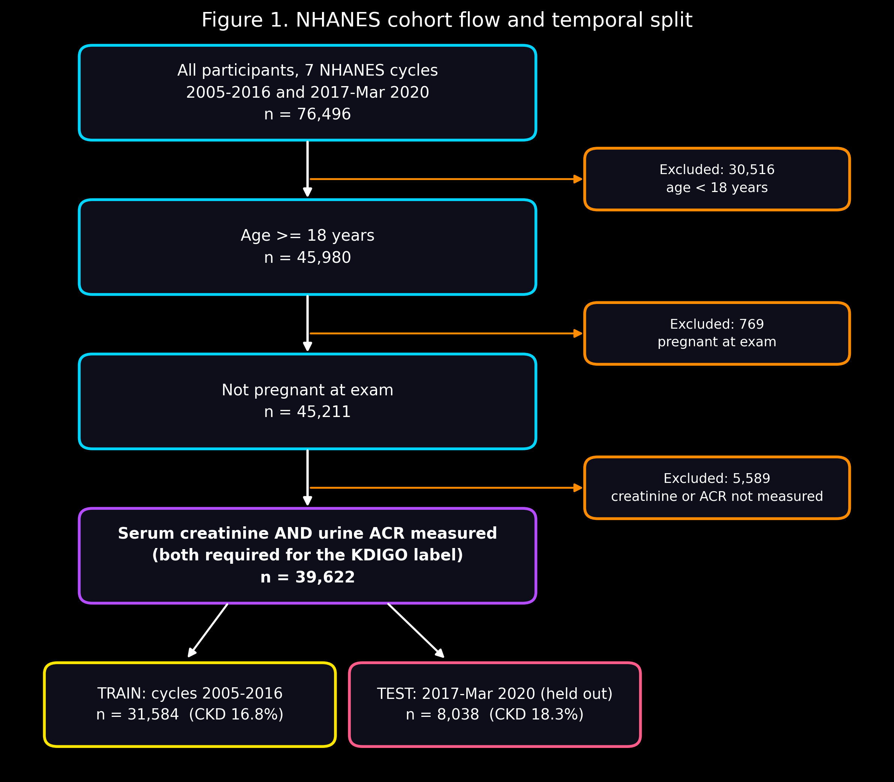
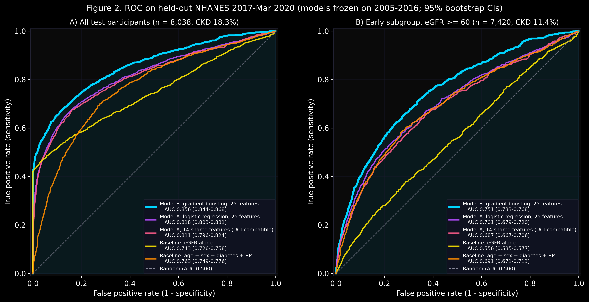
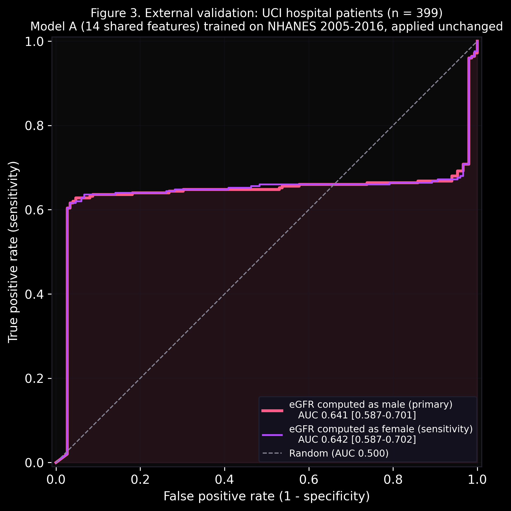
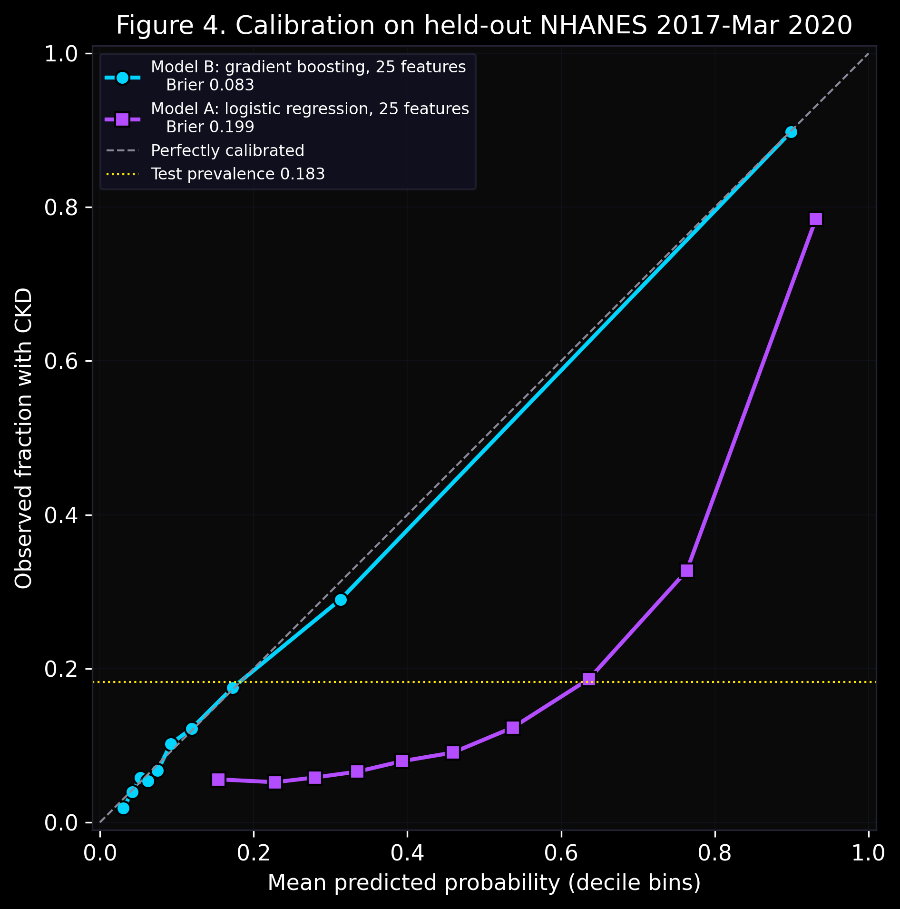
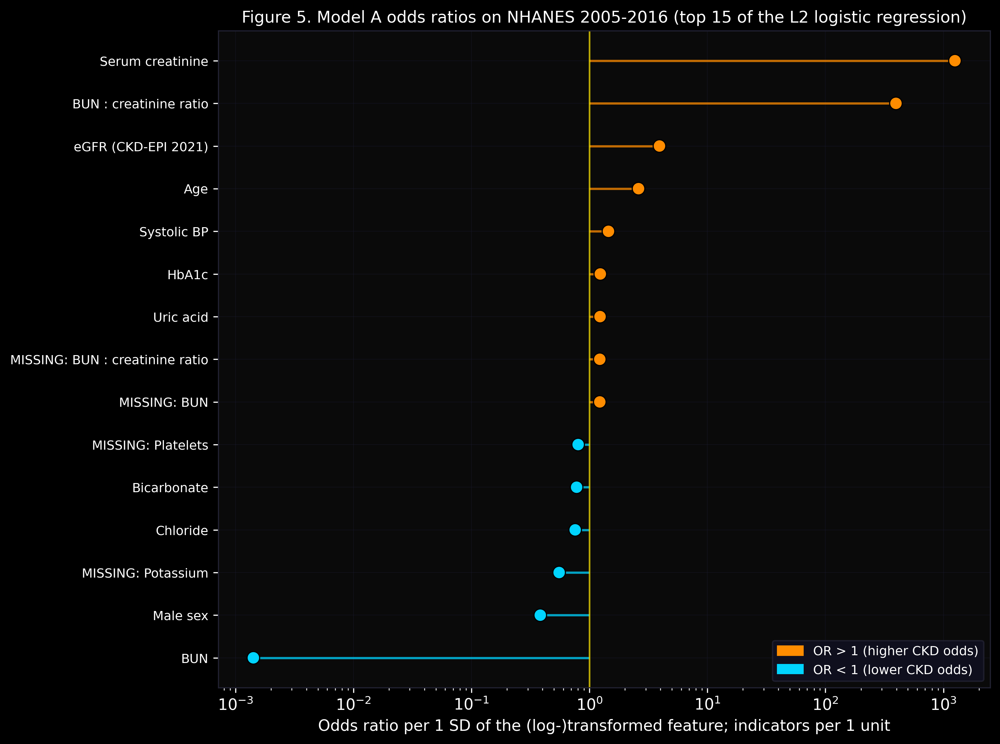
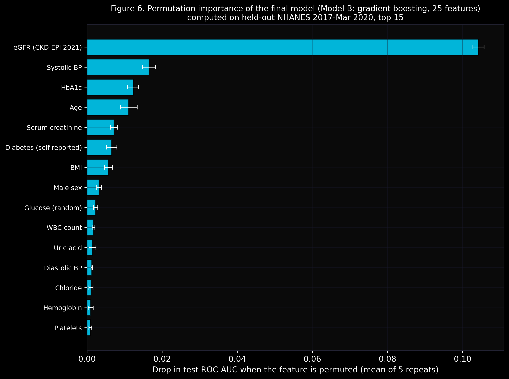
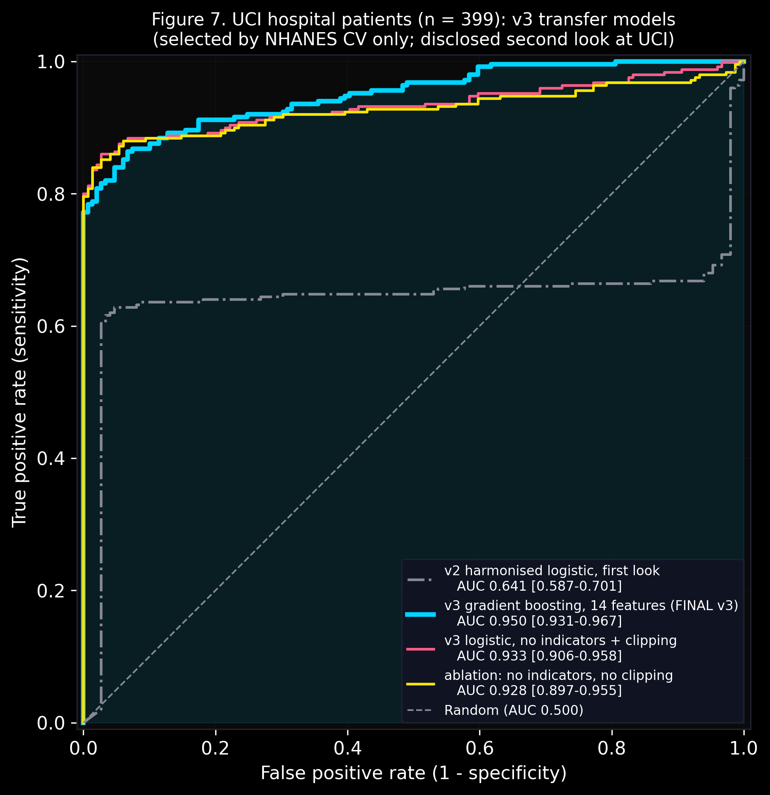

# Ren-AI-V1
ML pipeline for early Chronic Kidney Disease detection using clinical lab biomarkers — featuring eGFR derivation, two-stage feature contracts, and interpretable logistic regression with cross-validated AUC reporting.

## v2: NHANES (branch `nhanes-v2`)

v2 re-trains the pipeline on **39,622 US adults** from seven public CDC NHANES cycles
(2005-Mar 2020), validates it on a later, held-out cycle, and tests it on the original 399
UCI hospital patients. Label: KDIGO single-visit CKD (eGFR < 60 or urine ACR >= 30 mg/g).
Features: 17 routine blood tests + age, sex, BP, BMI, diabetes + 2 derived kidney scores
(CKD-EPI 2021 eGFR, BUN:creatinine ratio). Every modelling decision was frozen on the
2005-2016 training cycles before the 2017-2020 cycle was evaluated, once.

| result | value |
|---|---|
| Held-out ROC-AUC, 2017-Mar 2020 (n = 8,038), gradient boosting | **0.856** [0.844, 0.868] |
| Early-subgroup ROC-AUC (eGFR >= 60, albuminuria-only CKD) | **0.751** [0.733, 0.768] |
| Interpretable logistic model (v1 structure) on the same test set | 0.818 [0.803, 0.831] |
| Baselines: eGFR alone / age + sex + diabetes + BP | 0.743 / 0.763 |
| External validation, 399 UCI patients, first look (v2 logistic, 14 shared features) | 0.641 [0.587, 0.701] |
| External validation, same 399 patients, second look (v3 gradient boosting, pre-specified fix) | **0.950** [0.931, 0.967] |

The first external look was weak (0.64); a post-hoc diagnosis traced it to standardised
rare-missingness indicators inherited from v1 (AUC 0.98 on the 212 UCI patients with complete
labs). A v3 transfer model that drops the indicators, clips features to the NHANES training
range and uses gradient boosting on the same 14 features, selected by NHANES CV only, reaches
0.95 on a disclosed second look at the same 399 patients. Both numbers are reported together.
Full write-up, limitations and the claims sheet:
[`reports/nhanes/RESULTS.md`](reports/nhanes/RESULTS.md),
[`reports/nhanes/CLAIMS.md`](reports/nhanes/CLAIMS.md), run history in
[`reports/nhanes/run_log.md`](reports/nhanes/run_log.md).









Reproduce (needs `.venv` with `requirements.txt`; data is public and git-ignored):

```bash
bash scripts/download_nhanes.sh && for s in scripts/nhanes_0[1-9]_*.py scripts/nhanes_1[0-2]_*.py; do .venv/bin/python "$s"; done
```
